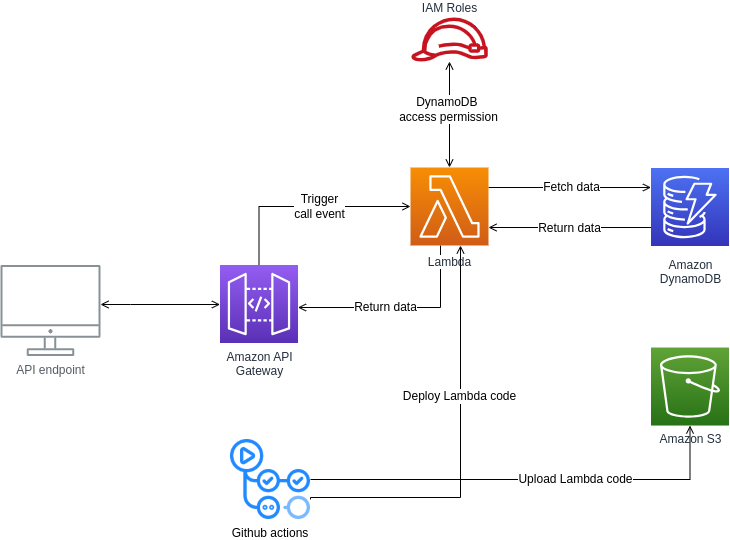

# Overview
Building a NoSQL database and setting up a Lambda function to fetch data items from the database and customizing an API gateway to trigger the Lambda function. A github action workflow is added to push the Lambda function code to S3 (which is used by the cloud formation to create the associated resources) and to deploy the Lambda code to Lambda.\


# Test
Use cURL to send a connection http request to the api gateway using the api URL:
```
curl {API_ENDPOINT_URL}
```
# Cloud services
- AWS Lambda
- AWS DynamoDB
- AWS API Gateway
- AWS Cloudformation
- AWS S3
- AWS IAM